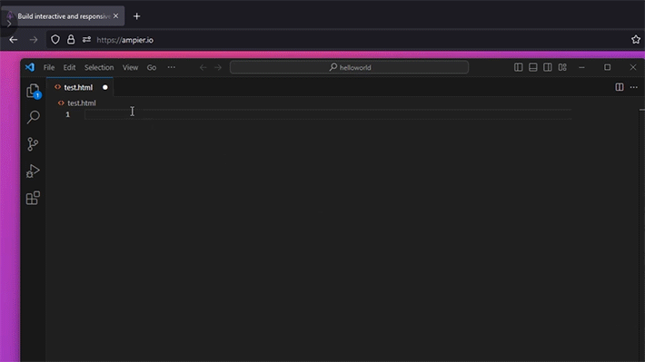

This extension for VS Code offers auto-completion and hover information for all TJML tags from a simple JSON file. TJML is an XML-like markup language built to create emails in a modern declarative style.

## TJML framework
This email framework enables the quick and convenient creation of cross-platform AMP and HTML emails using TJML.

- Find more about the TJML framework on [GitHub](https://github.com/pixcraft-io/TJML-framework).
- Access the TJML Framework [documentation](https://docs.pixcraft.io/en/).

## Demo

## Installation

You can install the extension through one of the following methods:

- Search for `Ampier` in the VSCode Extensions Panel and install it.
- Download it from the [Marketplace](https://marketplace.visualstudio.com/items?itemName=Pixcraft.vscode-tjml).
- Download it from [GitHub](https://github.com/pixcraft-io/vscode-tjml).
